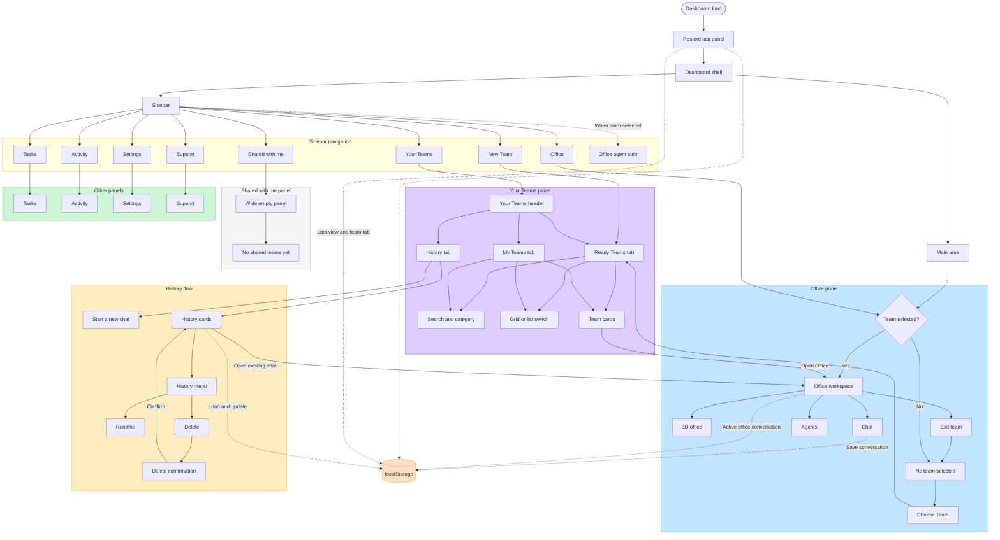

# Dashboard Panel Diagram

```mermaid
flowchart TD
    dashboardLoad([Dashboard load])
    restoreLastPanel[Restore last panel]
    dashboardShell[Dashboard shell]
    sidebar[Sidebar]
    mainArea[Main area]
    storage[(localStorage)]

    dashboardLoad --> restoreLastPanel
    restoreLastPanel --> dashboardShell
    restoreLastPanel -.-> storage
    dashboardShell --> sidebar
    dashboardShell --> mainArea

    subgraph sidebarGroup ["Sidebar navigation"]
        navNewTeam[New Team]
        navOffice[Office]
        navTasks[Tasks]
        navActivity[Activity]
        navYourTeams[Your Teams]
        navShared[Shared with me]
        navSettings[Settings]
        navSupport[Support]
        teamStrip[Office agent strip]
    end

    sidebar --> navNewTeam
    sidebar --> navOffice
    sidebar --> navTasks
    sidebar --> navActivity
    sidebar --> navYourTeams
    sidebar --> navShared
    sidebar --> navSettings
    sidebar --> navSupport
    sidebar -.->|"When team selected"| teamStrip

    subgraph officePanel ["Office panel"]
        officeState{Team selected?}
        officeWorkspace[Office workspace]
        officeScene[3D office]
        officeChat[Chat]
        officeAgents[Agents]
        exitTeam[Exit team]
        noTeam[No team selected]
        chooseTeam[Choose Team]
    end

    mainArea --> officeState
    navOffice --> officeState
    officeState -->|"Yes"| officeWorkspace
    officeWorkspace --> officeScene
    officeWorkspace --> officeChat
    officeWorkspace --> officeAgents
    officeWorkspace --> exitTeam
    exitTeam --> noTeam
    officeState -->|"No"| noTeam
    noTeam --> chooseTeam
    chooseTeam --> readyTeams

    subgraph teamsPanel ["Your Teams panel"]
        teamsHeader[Your Teams header]
        historyTab[History tab]
        readyTeams[Ready Teams tab]
        myTeams[My Teams tab]
        teamSearch[Search and category]
        viewSwitch[Grid or list switch]
        teamCards[Team cards]
    end

    navYourTeams --> teamsHeader
    navNewTeam --> readyTeams
    teamsHeader --> historyTab
    teamsHeader --> readyTeams
    teamsHeader --> myTeams
    readyTeams --> teamSearch
    readyTeams --> viewSwitch
    readyTeams --> teamCards
    myTeams --> teamSearch
    myTeams --> viewSwitch
    myTeams --> teamCards
    teamCards -->|"Open Office"| officeWorkspace

    subgraph historyPanel ["History flow"]
        historyEmpty[Start a new chat]
        historyCards[History cards]
        historyMenu[History menu]
        renameHistory[Rename]
        deleteHistory[Delete]
        deleteModal[Delete confirmation]
    end

    historyTab --> historyEmpty
    historyTab --> historyCards
    historyCards -->|"Open existing chat"| officeWorkspace
    historyCards --> historyMenu
    historyMenu --> renameHistory
    historyMenu --> deleteHistory
    deleteHistory --> deleteModal
    deleteModal -->|"Confirm"| historyCards

    subgraph sharedPanel ["Shared with me panel"]
        sharedEmpty[Wide empty panel]
        sharedMessage[No shared teams yet]
    end

    navShared --> sharedEmpty
    sharedEmpty --> sharedMessage

    subgraph otherPanels ["Other panels"]
        tasksPanel[Tasks]
        activityPanel[Activity]
        settingsPanel[Settings]
        supportPanel[Support]
    end

    navTasks --> tasksPanel
    navActivity --> activityPanel
    navSettings --> settingsPanel
    navSupport --> supportPanel

    officeChat -.->|"Save conversation"| storage
    historyCards -.->|"Load and update"| storage
    restoreLastPanel -.->|"Last view and team tab"| storage
    officeWorkspace -.->|"Active office conversation"| storage

    style officePanel fill:#C2E5FF,stroke:#3DADFF
    style teamsPanel fill:#DCCCFF,stroke:#874FFF
    style historyPanel fill:#FFECBD,stroke:#FFC943
    style sharedPanel fill:#F5F5F5,stroke:#B3B3B3
    style otherPanels fill:#CDF4D3,stroke:#66D575
    style storage fill:#FFE0C2,stroke:#FF9E42
```
